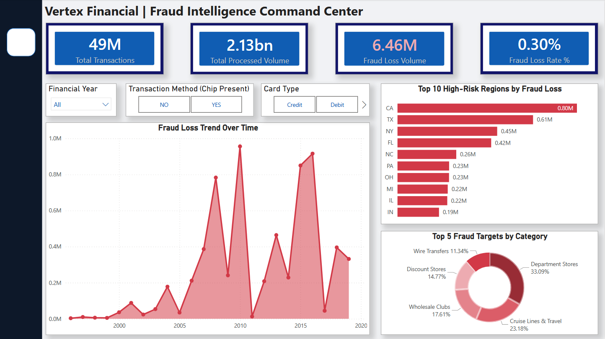

# Phase 2: Business Intelligence & Geospatial Analytics

## Executive Summary
Following the data engineering and ETL pipeline built in Phase 1, this phase focuses on translating 48.7 million rows of raw transactional data into actionable financial intelligence. 

I architected a high-performance **Star Schema** data model and developed a corporate-branded **Command Center Dashboard** for a conceptual client, "Vertex Financial." The objective was to move beyond static reporting and create an interactive cross-filtering engine that identifies fraud vulnerabilities across time, geography, and merchant categories.

## 📊 The Vertex Financial Command Center
*(Click to enlarge the dashboard preview)*

## 🏗️ Architectural Highlights

### 1. Data Modeling (The Engine Room)
* **Star Schema Implementation:** Engineered a 1-to-Many relational model connecting the 48.7M row Fact Table (`fact_transactions_clean`) to perfectly unique Dimension Tables (`dim_users_clean`, `dim_cards_clean`).
* **Composite Key Generation:** Bypassed standard Power BI auto-detect features to manually forge unique primary keys (e.g., `card_id` combining User Index and Card Index) using high-speed DAX, eliminating many-to-many relationship errors.
* **Query Optimization:** Utilized a Flat-File Handoff strategy from PostgreSQL to Power BI, leveraging the VertiPaq compression engine to handle large-scale data in-memory without system degradation.

### 2. Advanced DAX Development (The Intelligence)
Moved beyond simple row counts to develop normalized risk metrics, allowing for true comparative analysis.
* `Total Processed Volume` = `SUM('fact_transactions_clean'[amount_numeric])`
* `Fraud Loss Volume` = `CALCULATE(SUM('fact_transactions_clean'[amount_numeric]), 'fact_transactions_clean'[is_fraud] = "Yes")`
* `Fraud Loss Rate %` = `DIVIDE([Fraud Loss Volume], [Total Processed Volume], 0)`

### 3. UX/UI & Application Design
* **Corporate Brand Identity:** Designed the UI using a professional dark navy/slate grey palette ("Vertex Financial" aesthetic) utilizing the "Rule of Three" for filter placement and precise Z-pattern visual hierarchy.
* **Categorical Translation:** Authored a DAX `SWITCH` statement to translate raw numeric ISO Merchant Category Codes (e.g., 5311, 5300) into executive-readable text ("Department Stores", "Wholesale Clubs") on the fly.
* **Temporal & Categorical Filtering:** Implemented deep drill-down capabilities, allowing stakeholders to isolate fraud spikes by specific financial years, card types (Credit/Debit), and transaction methods (Chip Present/Online).

## 🚀 Key Business Insights Discovered
1. **The Vulnerability Peak:** The chronological Area Chart revealed massive, irregular spikes in fraud volume specifically concentrated around the 2011 and 2015 financial years.
2. **Geographical Hotspots:** The Top 10 Regions analysis identified California ($0.80M) and Texas ($0.61M) as the absolute highest-risk zones for total financial loss.
3. **Primary Targets:** The Donut visualization exposed that **Department Stores** and **Cruise Lines & Travel** absorb the vast majority of the fraud impact, heavily outweighing other merchant categories.